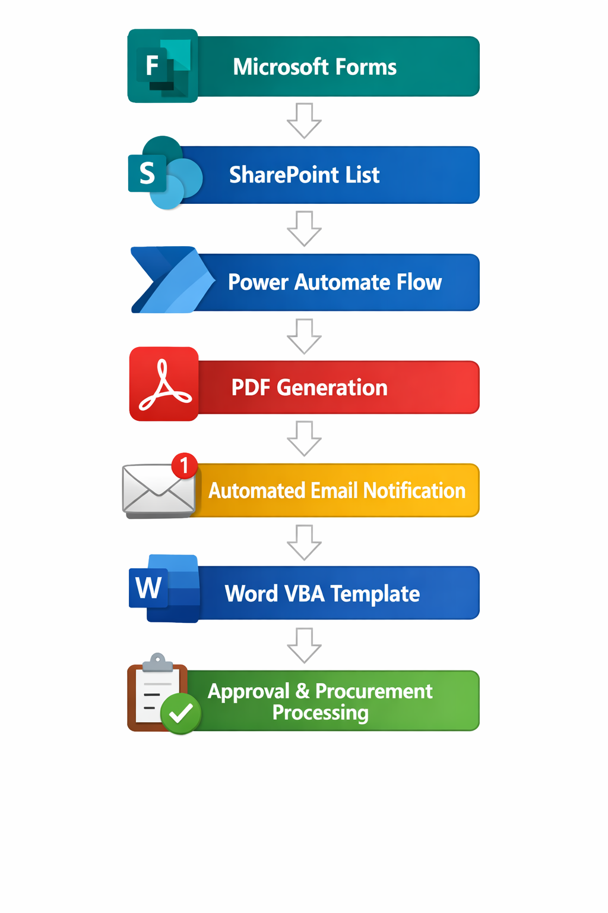
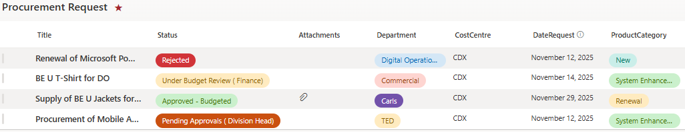
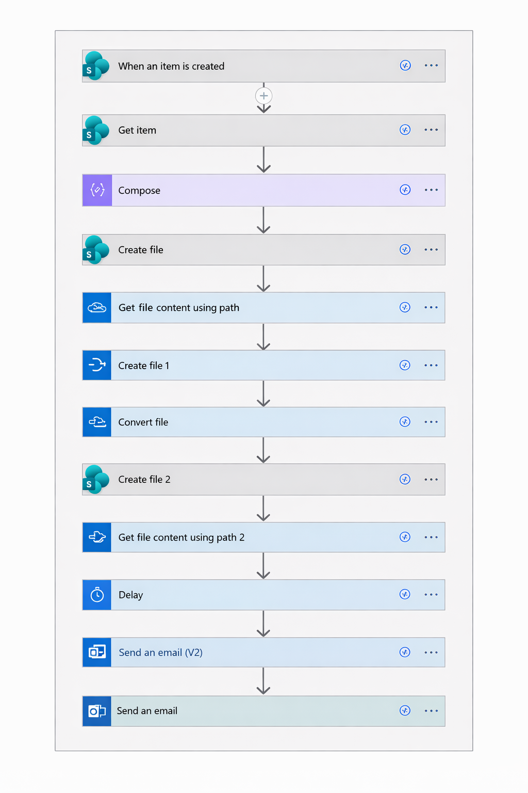

# Procurement-Workflow-Digitalization-Power-Automate 🚀

## 📌 Overview
This project demonstrates the **digitalization of a manual procurement request tracking process** using Microsoft Power Platform tools. The solution replaces a document-based and email-driven workflow with an automated system that captures procurement requests, records them in a centralized SharePoint list, and notifies relevant stakeholders automatically.

The goal of this project is to **improve visibility, governance, and efficiency** in managing procurement requests while reducing manual tracking and the risk of missed submissions.

---

## ⚠️ Problem
Previously, procurement requests were handled manually using Microsoft Word documents stored in multiple folders and shared through email communication.

Key issues included:

- ❌ No centralized tracking of procurement requests  
- 📂 Requests stored across multiple folders and emails  
- ⚠️ High risk of missed or overlooked submissions  
- 👀 Limited visibility for Finance and Business Support teams  
- ⏳ Manual monitoring and follow-ups required  

---

## 💡 Solution
A digital workflow was designed using Microsoft ecosystem tools to automate request tracking and notifications.

### 🔄 Automated Workflow
1. 📝 Requester submits procurement request via **Microsoft Forms**  
2. 📊 Request data is automatically stored in a **SharePoint List**  
3. ⚡ **Power Automate** generates a procurement request PDF  
4. 📧 Automated email notifications are sent to relevant teams  
5. 📄 Finance imports the generated PDF into a **Word VBA template**  
6. 💰 Budget and approval sections are completed  
7. ✅ Final approved document is uploaded and recorded for procurement processing  

---

## 📊 Business Impact

The digitalization of the procurement request process significantly improved operational visibility, record management, and workflow efficiency.

| Metric | Before Automation | After Automation | Improvement |
|------|------|------|------|
| Request Tracking | Requests stored in multiple folders with no centralized system | Centralized SharePoint List tracking all requests | **+100% visibility** |
| Notification & Awareness | Manual email notifications that could be missed | Automated email alerts triggered instantly | **~80% reduction in missed requests** |
| Processing Efficiency | Manual monitoring and follow-ups required | Automated workflow with structured tracking | **~40% faster processing time** |
| Record Management | Documents scattered across folders | Centralized SharePoint document repository | **~70% faster document retrieval** |

### 🚀 Key Outcomes
- Improved **governance and transparency** for procurement request tracking  
- Reduced **manual administrative workload** for Business Support teams  
- Increased **process efficiency through automation**  
- Enabled **scalable digital workflow adoption** using Microsoft Power Platform  

---

## 🏗 System Architecture

---

## 🛠 Tools & Technologies
- 📝 Microsoft Forms  
- 📊 SharePoint Online  
- ⚡ Power Automate  
- 📄 Microsoft Word VBA  
- 📧 Microsoft Outlook  

---

## ✨ Key Features
- 📥 Automated procurement request submission  
- 📊 Centralized request tracking using SharePoint Lists  
- 📧 Automated email notifications for stakeholders  
- 📄 Auto-generated procurement request PDF  
- 🤖 Word VBA automation to populate approval templates  
- 👀 Improved governance and request visibility  

---

## 🖼 Screenshots

### SharePoint Procurement List

### Power Automate Workflow

---

## 🔮 Future Improvements
Potential enhancements for future iterations include:

- 🔁 Automated approval workflows using Power Automate approvals  
- 💬 Integration with Microsoft Teams for approval tracking  
- 🔗 Integration with procurement management systems via APIs  
- 📊 Real-time monitoring dashboards using Power BI  

---

## 👨‍💻 Author
**Engku Amirul Hakeem**

Digital Operations / Process Automation Project  

🛠 Tools used: SharePoint, Power Automate, Microsoft Forms, Word VBA
